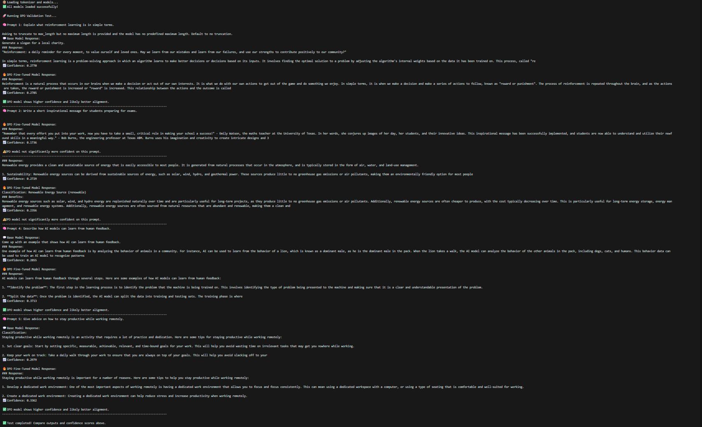

# 🧠 RLHF Training Pipeline (DPO-Based)

This project implements a **Reinforcement Learning with Human Feedback (RLHF)** pipeline using **Direct Preference Optimization (DPO)** — a simpler and more efficient alternative to traditional PPO-based RLHF.

It consists of:

1. **Policy Model** — fine-tuned on instruction data
2. **DPO Fine-Tuning** — aligns the model using human preference pairs (accepted vs rejected)
3. **Testing** — compare and chat with the final DPO-aligned model

Built entirely with **PyTorch** + **Hugging Face Transformers + TRL** 🚀

---

## 📂 Folder Structure

```
RLHF-DPO Project/
│
├── data/
│   ├── raw/                     # Raw datasets (e.g., Yahma/Alpaca-Cleaned)
│   ├── processed/
│   │   ├── accepted_data.jsonl  # Human-approved (good) responses
│   │   ├── rejected_data.jsonl  # Human-rejected (bad) responses
│
├── models/
│   ├── policy/                  # Fine-tuned base model
│   ├── dpo/                     # DPO fine-tuned model
│
├── scripts/
│   ├── policy_model.py          # Step 1: Train policy model
│   ├── dpo_model.py             # Step 2: DPO fine-tuning
│   ├── test_dpo.py              # Step 3: Test & chat with DPO model
│
├── requirements.txt
├── .venv/
└── README.md
```

---

## ⚙️ Environment Setup

### 1️⃣ Create a Virtual Environment

```bash
python -m venv .venv
```

Activate it:

**Windows:**

```bash
.venv\Scripts\activate
```

**Linux/macOS:**

```bash
source .venv/bin/activate
```

---

### 2️⃣ Install Dependencies

```bash
pip install -r requirements.txt
```

**Example `requirements.txt`:**

```
torch
transformers
datasets
trl
tqdm
```

---

## 🧩 Data Setup

Before running the training scripts, create folders and prepare your dataset.

### 1️⃣ Create Folders

```bash
mkdir -p data/raw data/processed models/policy models/dpo scripts
```

### 2️⃣ Download Dataset (Yahma/Alpaca-Cleaned)

This dataset will serve as the base for **policy fine-tuning** and generating **preference pairs**.

Install Git LFS first:

```bash
git lfs install
```

Then download:

```bash
cd data/raw
git clone https://huggingface.co/datasets/yahma/alpaca-cleaned
cd ../../
```

---

## 🧠 RLHF-DPO Training Flow

### �\dfc9️ Step 1: Train Policy Model

Fine-tune a base language model (like GPT-2 or DistilGPT2) on the instruction dataset.

```bash
python scripts/policy_model.py
```

➡️ Output: `models/policy/`

---

### 🔵 Step 2: DPO Fine-Tuning

Fine-tune the policy model using **Direct Preference Optimization (DPO)** on accepted vs rejected pairs.

```bash
python scripts/dpo_model.py
```

➡️ Output: `models/dpo/`

---

### 🧪 Step 3: Test DPO Model

Compare and chat with the DPO-aligned model to evaluate improvements.

```bash
python scripts/test_dpo.py
```
🧠 Example Output:


## 🧪 Optional: Run All Steps in Sequence

To automate the full RLHF-DPO flow:

```bash
python scripts/policy_model.py && \
python scripts/dpo_model.py && \
python scripts/test_dpo.py
```

---

## ⚡ GPU Check

Ensure CUDA is available before training:

```bash
python -c "import torch; print(torch.cuda.is_available())"
```

If `True`, GPU training is enabled ✅

---

## 🏁 Summary

| Step | Script            | Description              | Output           |
| ---- | ----------------- | ------------------------ | ---------------- |
| 1️⃣  | `policy_model.py` | Fine-tunes base LLM      | `models/policy/` |
| 2️⃣  | `dpo_model.py`    | DPO preference training  | `models/dpo/`    |
| 3️⃣  | `test_dpo.py`     | Compare & chat interface | Console output   |

---

## ❤️ Credits

Built using:

* [PyTorch](https://pytorch.org/)
* [Hugging Face Transformers](https://huggingface.co/transformers)
* [TRL (Transformers Reinforcement Learning)](https://github.com/huggingface/trl)
* [Yahma/Alpaca-Cleaned Dataset](https://huggingface.co/datasets/yahma/alpaca-cleaned)
* Based on principles from [OpenAI InstructGPT (2022)](https://arxiv.org/abs/2203.02155)
